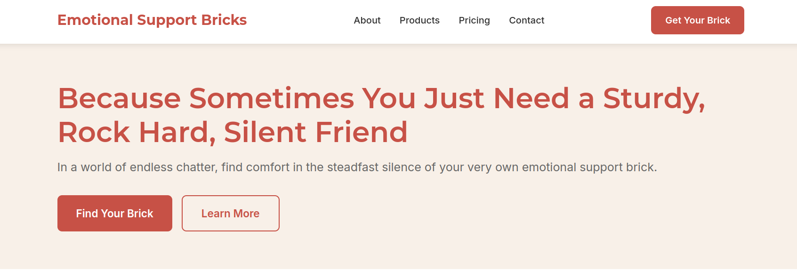
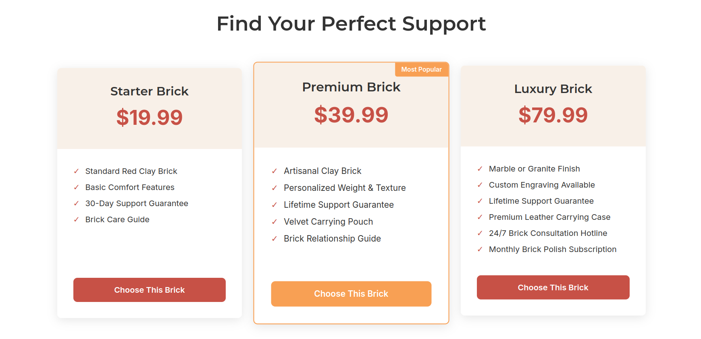
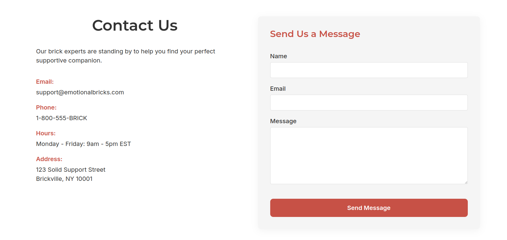

# Emotional Support Bricks

WE SELL SUPPORT BRICKS. SO WHAT?

## Description

Emotional Support Bricks is a support for everyone. You want to touch something? Feel the warmth of the soil or the cold of the rocks? We are here for you and your hurt soul.
You know how Toni Braxton would say - Un-break My Heart! Our bricks (especially the marble one) does that on an extensive measure without any hesitation. We even had an idea to 
design the Brick +, for the gym buddies, be like Rock Lee, you know? If you drop that brick, it would create a hole in the time space continuum.
So don't hesitate to buy a brick from us. We make them with clay!

## Screenshots
#### THE HERO:

### THE PRICING:

### THE CONTACT US:

FOR MORE LOOK INTO THE LIVE DEMO!

## Live Demo

Check out the live demo: [Emotional Support Bricks](TODO)

## Features

- Responsive design that works on mobile, tablet, and desktop
- Component-based CSS architecture
- Clean, modern aesthetic with a brick-inspired color scheme
- Intuitive navigation and user experience

## Technologies Used

- HTML5
- CSS3
- Google Fonts (Inter and Montserrat)

### File Structure

- `index.html` - Main HTML file
- `css/` - CSS files
  - `reset.css` - CSS reset
  - `styles.css` - Main styles
  - `components/` - Component-specific styles
    - `buttons.css`
    - `cards.css`
    - `navigation.css`
    - `hero.css`
    - `footer.css`
- `images/` - Image assets

## Deployment

The site is deployed on Vercel.

## License

None. Use it however you want!